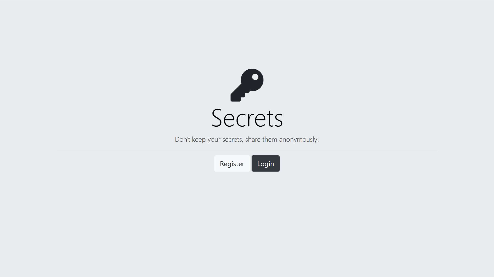

# 🔑 Secrets
Secrets is a website that lets you share your secrets to the world anonymously.


## Features
🔹Read other people's secrets without knowing who the teller is. </br>
🔹Register on our website or Sign In to Submit your secret. <br />
 (Secrets uses **Google** and **Facebook Authentication** to register users. Register hassles-free!)

## Live Application URL

Go to Deployed Application link 👇 <br />
<a href="https://secrets-srl6.onrender.com" alt="App-link" target="_blank">Secrets</a> </br>


## Secrets Preview

 <br />


## Prerequisites

 ### Install Node JS
 Refer <a href="https://nodejs.org/en/" alt="node.js-link" target="_blank">Official Website</a> to download and install Node.js

## Cloning and Running the Application in local

1. cd to the location in terminal where you want to clone the repository.

```
  cd your_path
```

2. Clone the project into the local:

```
  git clone https://github.com/Kakuli-coder/Secrets.git
```

3. Go to the directory:

```
  cd Secrets
```
  
4. Install all the npm packages:

```
  npm install
```

5. In order to run the application, type the following command:

```
  npm start
```
Yay! Your application is up and running.
